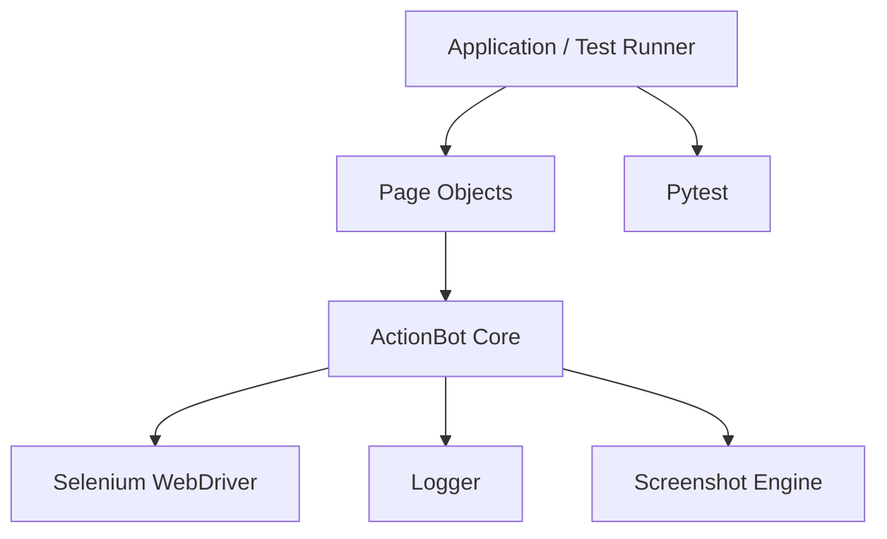

# O-Actions RPA Framework 🤖

Framework Python para automação web com Selenium, criado para transformar automações repetitivas em fluxos legíveis, testáveis e fáceis de manter.

[](https://www.python.org/)
[](https://opensource.org/licenses/MIT)

## Objetivos

- Reduzir código repetitivo em automações Selenium.
- Centralizar espera, localização de elementos, screenshots e logging.
- Separar Page Objects da engine de automação.
- Facilitar testes de regressão e diagnóstico de falhas.

## Arquitetura



## Recursos

| Recurso | Implementação |
| :--- | :--- |
| Smart Locators | `id:`, `name:`, `xpath:`, `css:`, `class:`, `text:` e outros |
| Condition-based waits | `WebDriverWait` + Selenium Expected Conditions |
| Page Object Model | Page Objects desacoplados do driver |
| Diagnóstico | Logging e screenshot em falhas |
| Testes | Pytest + fixtures |
| Lifecycle seguro | Context manager + `quit()` idempotente |

## Instalação

```bash
git clone https://github.com/THPL28/rpa_project_o_actions.git
cd rpa_project_o_actions
python -m venv .venv

# Windows
.venv\Scripts\activate

# Linux/macOS
source .venv/bin/activate

pip install -r requirements.txt
```

## Configuração

Use variáveis de ambiente para valores de execução. Nunca coloque credenciais ou segredos no código-fonte.

Exemplo:

```properties
DEBUG=true
HEADLESS=false
DEFAULT_TIMEOUT=15
```

## Uso

```python
from src.core.bot import ActionBot

with ActionBot(headless=True) as bot:
    bot.open("https://parabank.parasoft.com")
    bot.type("name:username", "john_doe")
    bot.type("name:password", "secret123")
    bot.click("class:button")
    bot.screenshot("dashboard_check")
```

> Para projetos reais, credenciais devem vir de variáveis de ambiente ou de um secret manager, e não de exemplos com valores reais.

## Testes

Execute a suíte com:

```bash
pytest
```

Quando um teste de UI falha durante a fase de execução, o fixture compartilhado tenta gerar uma screenshot para facilitar o diagnóstico.

## Estrutura

```text
src/
├── core/           # ActionBot e logging
├── page_objects/   # Page Objects
└── utils/          # Utilitários
app/                # Entrada/orquestração
tests/              # Testes e fixtures
```

## Práticas de engenharia

- Prefira waits condicionais a `time.sleep()`.
- Não registre senhas, tokens ou dados pessoais em logs.
- Mantenha os locators dentro dos Page Objects quando fizer sentido.
- Adicione testes unitários para regras do framework e testes de integração para fluxos Selenium.
- Execute os testes em CI antes de publicar mudanças.

## Roadmap técnico

- [ ] Cobertura automatizada com `pytest-cov`.
- [ ] Lint e formatação com Ruff.
- [ ] Type checking com mypy.
- [ ] Pipeline GitHub Actions para lint + testes.
- [ ] Relatórios de execução com artefatos de screenshots.
- [ ] Testes de contrato para a API pública do framework.

## Licença

MIT.

Desenvolvido por **THPL28**.
