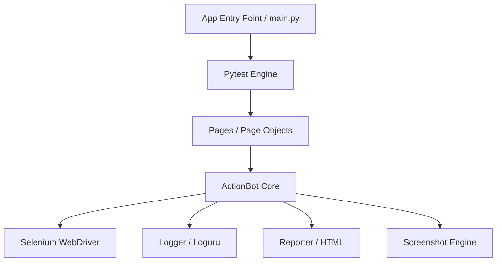

# O-Actions RPA Framework 🤖✨

[](https://www.python.org/downloads/)
[](https://opensource.org/licenses/MIT)
[](#)
[](https://www.selenium.dev/)

**O-Actions** é um framework de automação de processos robóticos (RPA) de próxima geração. Projetado para transformar scripts complexos de Selenium em fluxos de trabalho legíveis, robustos e fáceis de manter.

---

## 🏗️ Arquitetura do Sistema

O framework utiliza o padrão Page Object (POM) desacoplado da engine de automação, permitindo uma manutenção simplificada e alta escalabilidade.



---

## 🚀 Diferenciais de Elite

| Recurso | Descrição | Vantagem |
| :--- | :--- | :--- |
| **Smart Locators** | Strings intuitivas como `id:login` ou `xpath://*` | Reduz boilerplate e aumenta legibilidade |
| **Auto-Wait Engine** | Gerenciamento de espera implícita e explícita | Elimina erros de sincronismo (Flaky Tests) |
| **Fluent Syntax** | Métodos encadeados e semânticos | Escrita de scripts 3x mais rápida |
| **Enhanced Logging** | Logs coloridos e rotativos via Loguru | Depuração profissional e auditoria completa |
| **Visual Reporting** | Relatórios HTML com screenshots embutidos | Visibilidade clara para stakeholders |

---

## 🛠️ Instalação Rápida

```bash
# 1. Clone o repositório
git clone https://github.com/THPL28/rpa_project_o_actions.git
cd rpa_project_o_actions

# 2. Configure o ambiente virtual
python -m venv venv
./venv/Scripts/activate  # Windows

# 3. Instale as dependências
pip install -r requirements.txt
```

---

## ⚙️ Configuração (Environment)

O framework utiliza variáveis de ambiente para fácil alternância entre contextos (Dev/Prod).

Crie um arquivo `.env` na raiz:
```properties
DEBUG=true
HEADLESS=false
DEFAULT_TIMEOUT=15
```

---

## 📋 Demonstração de Uso

### Execução de Testes & RPA
Execute o motor principal para rodar a suite completa e gerar o report:
```bash
python app/main.py
```

### Exemplo de Código (Sintaxe O-Actions)
```python
from src.core.bot import ActionBot

# Inicialização elegante
with ActionBot(headless=True) as bot:
    bot.open("https://parabank.parasoft.com")
    
    # Interação simplificada com Smart Locators
    bot.type("name:username", "john_doe")
    bot.type("name:password", "secret123")
    bot.click("class:button")
    
    # Validação e Feedback visual
    bot.screenshot("dashboard_check")
```

---

## 📁 Organização Modular

- 📂 `src/core/`: Engine central (`ActionBot`, `Logger`).
- 📂 `src/page_objects/`: Modelagem semântica das telas.
- 📂 `src/utils/`: Geradores de relatórios e captura de arquivos.
- 📂 `app/`: Orquestrador e CLI do framework.
- 📂 `tests/`: Suite de testes de regressão e fumaça.
- 📂 `logs/`: Logs de auditoria persistidos.
- 📂 `reports/`: Relatórios visuais gerados.

---

## 🛡️ Contribuição & Licença

Contribuições são bem-vindas! Sinta-se à vontade para abrir Issues ou Pull Requests.

Distribuído sob a licença MIT. Veja `LICENSE` para mais informações.

---
<p align="center">
  Desenvolvido com ❤️ para a comunidade de automação por <b>THPL</b>
</p>
